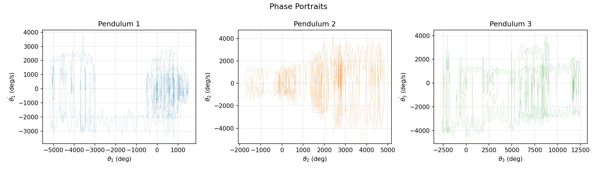

# Driven Quadruple Pendulum

Chaotic dynamics of four coupled masses, simulated with a hand-coded integrator and validated
against a reference solver. Submitted for **PC3236 Computational Methods in Physics**.

**[Read the report (PDF)](report/driven-quadruple-pendulum.pdf)**



## The problem

A quadruple pendulum has four coupled degrees of freedom and no closed-form solution. Its
equations of motion are stiff, strongly nonlinear, and exponentially sensitive to initial
conditions, which makes it a good test case both for numerical integration and for the
signatures of deterministic chaos.

## Method

1. **Derivation.** Lagrangian equations of motion for the four coupled masses, reformulated as
   an eight-dimensional system of first-order ODEs.
2. **Integration.** A hand-coded fourth-order Runge-Kutta scheme at a fixed 0.001 s time step,
   rather than a library solver, so the integration behaviour is fully under inspection.
3. **Linear algebra.** The 4x4 mass matrix is solved by LU decomposition at every RK4 stage.
4. **Validation.** The custom integrator is checked against SciPy's adaptive RK45 solver and
   agrees to within one microradian over a 20 s trajectory.
5. **Chaos characterisation.** Poincaré sections, bifurcation diagrams, and Lyapunov divergence
   plots, plus an animation whose physical parameters can be varied interactively.

## Results

| Figure | Shows |
|---|---|
| [`time_series.png`](figures/time_series.png) | Angular displacement of each mass over time |
| [`phase_portraits.png`](figures/phase_portraits.png) | Phase-space structure per degree of freedom |
| [`poincare.png`](figures/poincare.png) | Poincaré section, revealing the chaotic attractor |
| [`bifurcation.png`](figures/bifurcation.png) | Route to chaos as the drive parameter varies |
| [`sensitivity.png`](figures/sensitivity.png) | Lyapunov divergence of neighbouring trajectories |
| [`energy.png`](figures/energy.png) | Energy drift, as a check on integrator stability |
| [`scipy_comparison.png`](figures/scipy_comparison.png) | Custom RK4 against SciPy RK45 |

## Contents

```
code/quadruple_pendulum.ipynb   simulation, analysis and figure generation
code/report.typ                 Typst source of the report
figures/                        generated plots
report/driven-quadruple-pendulum.pdf   compiled report
```

## Running it

```bash
pip install numpy scipy matplotlib
jupyter lab code/quadruple_pendulum.ipynb
```

---
Code: MIT. Report and figures: CC BY-NC-ND 4.0. See [DISCLAIMER.md](../../DISCLAIMER.md).
